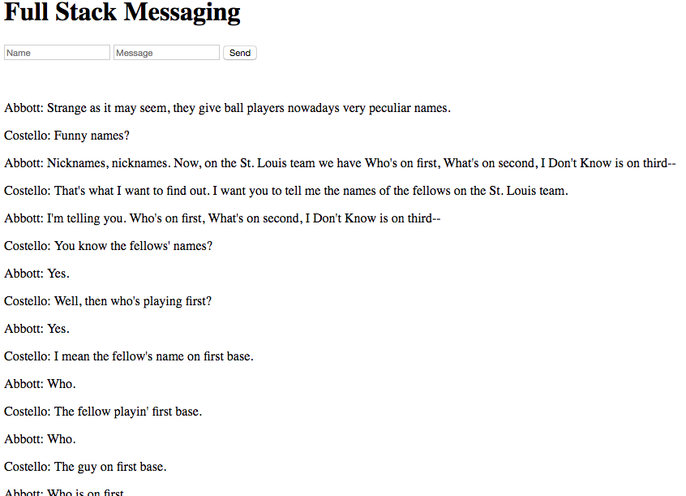

# Code-Challenge-5

- [x]  Your Front End should have two inputs. One for the user's name, the other for the user's message. Additionally, there should be a submit button,
- [x]  When the submit button is clicked, you must send the name and message from the inputs to the server to be written to a SQL Database
- [x]  Once the message has been successfully written to the database, display all messages on the DOM,
- [x]  If the application page is reloaded, all previous messages should appear.

## Mockup

